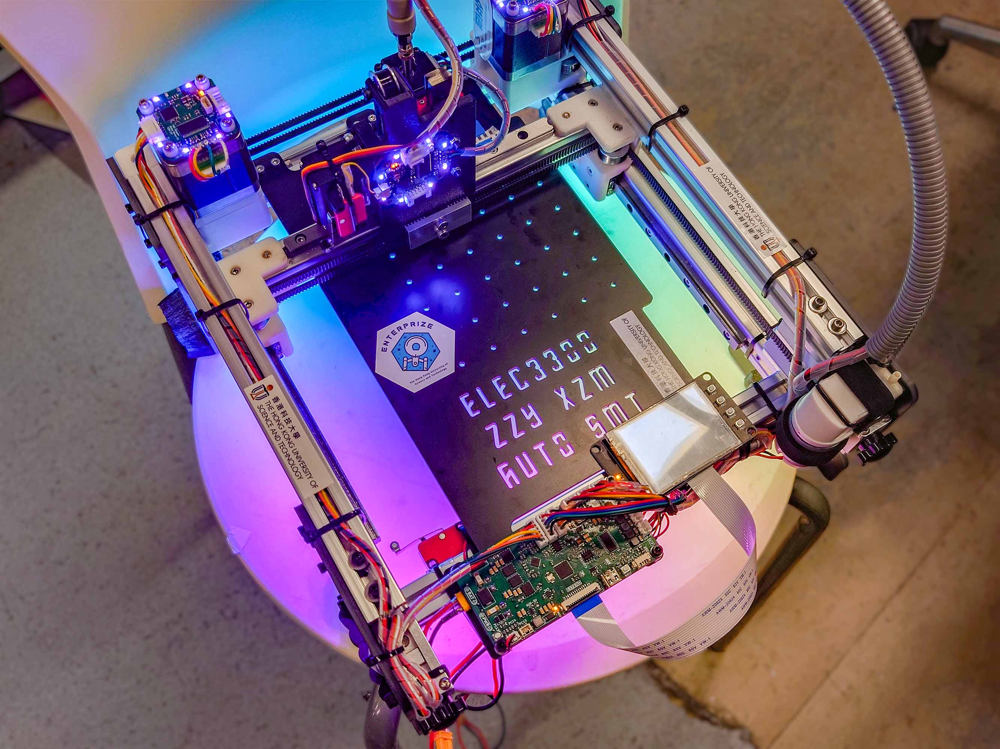
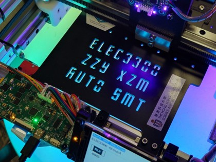
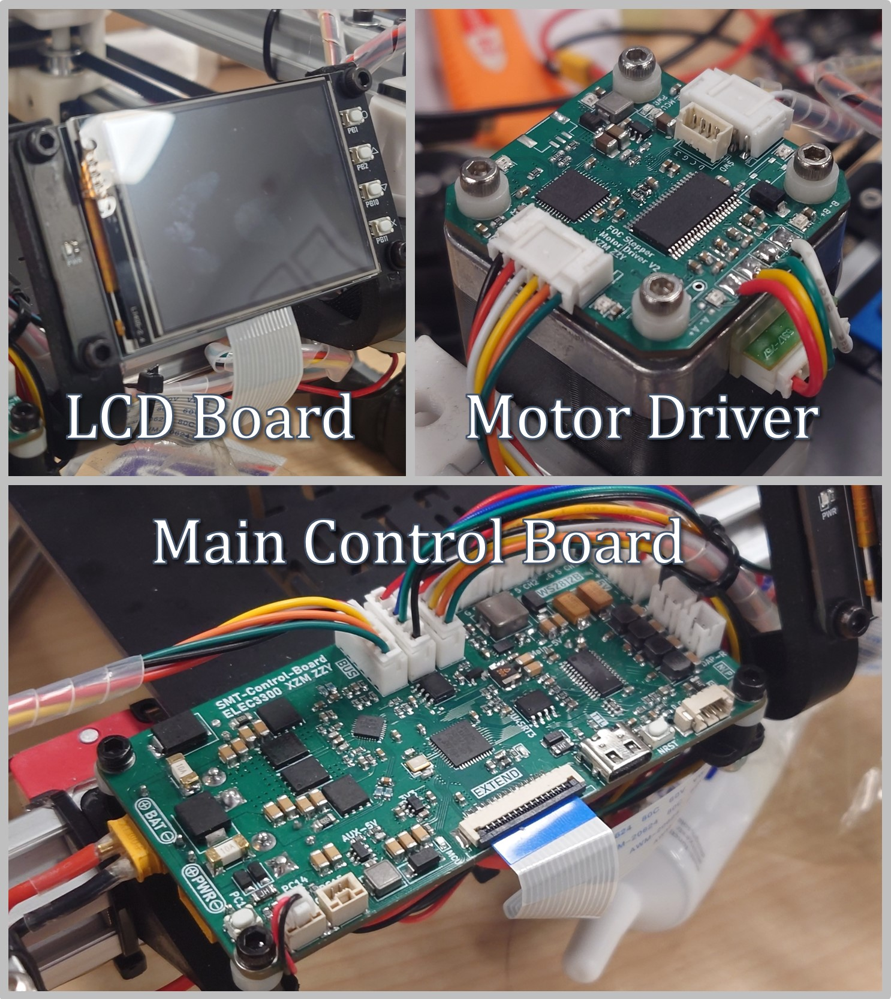
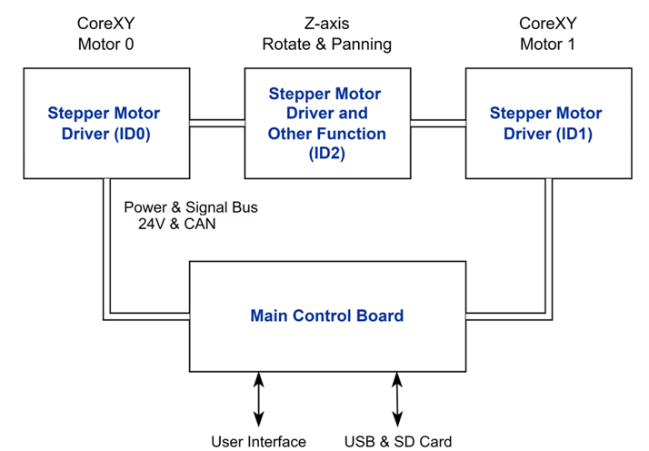
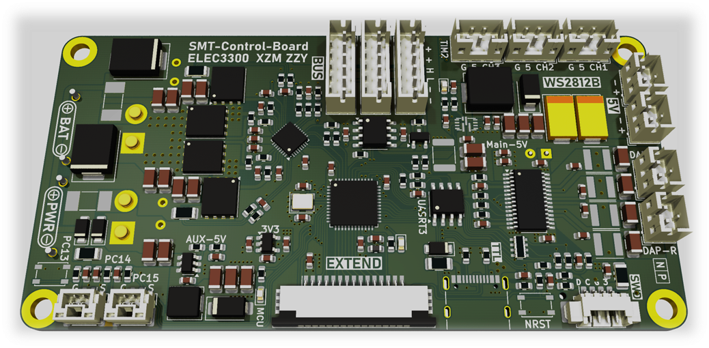
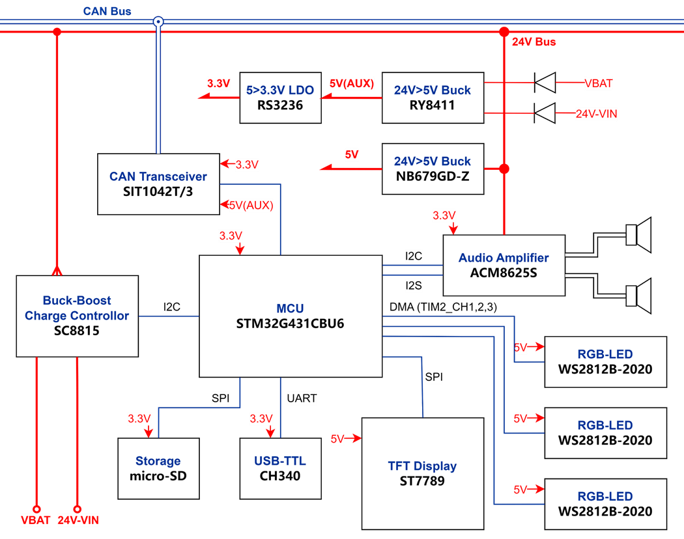
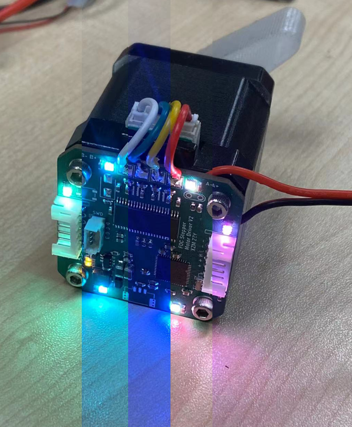
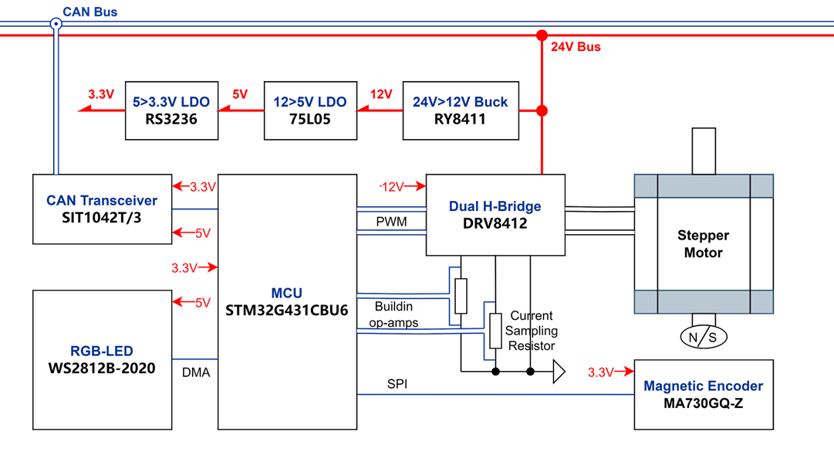

# :fire: Awesome :fire: SMT Machine

[](http://choosealicense.com/licenses/mit/)

Contributors:
<p float="left">
  <a href="https://github.com/baoqi-zhong"></a>
  <a href="https://github.com/ZimingXian"></a>
</p>

**Awesome SMT Machine** began as a HKUST course project and now become project with software, hardware and mechanical design completely open sourced. This project integrates another project **Nema-17 stepper motor FOC driver**.

<p float="left">
  
  
</p>

**Key Features**:
- **Core-XY Structure**: Enhanced precision, High speed.
- **FOC Stepper Motor Driver**: Low heat, improved efficiency, very quiet.
- **LCD Display**: 4.2-inch color touch screen.


# Hardware
<p float="left">
  
  
</p>

PCB design is based on Kicad.

File description:
```
./Hardware/
    Main-Control-Board          Main Board
    Stepper-Motor-FOC-Driver    Nema-17 stepper motor FOC driver
    LCD-Board                   TFT display
    Dual-Head-Motor-Driver      (Ongoing) PCB on the placement head of the dual head design.
```

## Main Control Board
<p float="left">
  
  
</p>

Based on STM32G431CBU6 MCU, SC8815 battery management, ACM8625S I2S audio amplifier. More detail, see [Main Control Board Schematic](./Hardware/Main-Control-Board/Main-Control-Board-Schematic.pdf)

**Key Features**:
- **UART Interface**: Communicate with Python code.
- **6S Battery Charger**: Fast charging, wide input voltage.
- **Audio Amplifier & Speaker**: interesting, huh..? :yum:
- **CAN Bus Communication**: High reliability and scalability.
- **RGB!**: ~~200% performance improvement!~~

## Stepper Motor FOC Driver
<p float="left">
  
  
</p>

Based on STM32G431CBU6 MCU, DRV8412 gate driver, MA732 magnetic encoder, WS2812 RGB led. More detail, see [Stepper Motor FOC Driver Schematic](./Hardware/Stepper-Motor-FOC-Driver/Stepper-Motor-FOC-Driver-Schematic.pdf)

**Key Features**:
- **Self-Written FOC Algorithm**: Torque, speed, angle 3 close loop control.
- **Real Current Loop**: Precise torque control.
- **14-Bit Encoder**: Calibrated, high accuracy.
- **CAN Bus Communication**: High reliability and scalability.
- **RGB!**: ~~200% performance improvement!~~

# Software
Embeded software is based on STM32CubeMX + Makefile + gcc.

File description:
```
./Software/
    ClosePnP                        Got it name from OpenPnP, ClosePnP is the controller software of the machine
    Main-Control-Board-Software     STM32 code for main board
    Stepper-Motor-Driver-Software   Stepper motor FOC Algorithm code
    MusicConverter                  Convert .WAV file into .c files for playing music test.
    Dual-Head-Motor-Driver-Software (Ongoing) The placement head PCB's motor driver.
```

# Mechanical
Single head (original version) is designed with C4D. The newer dual head version is designed with SolidWorks. Sorry for the mismatch.
Single head version file: ./Mechanical/CoreXY.c4d or ./Mechanical/CoreXY.stl These 2 are the same.

