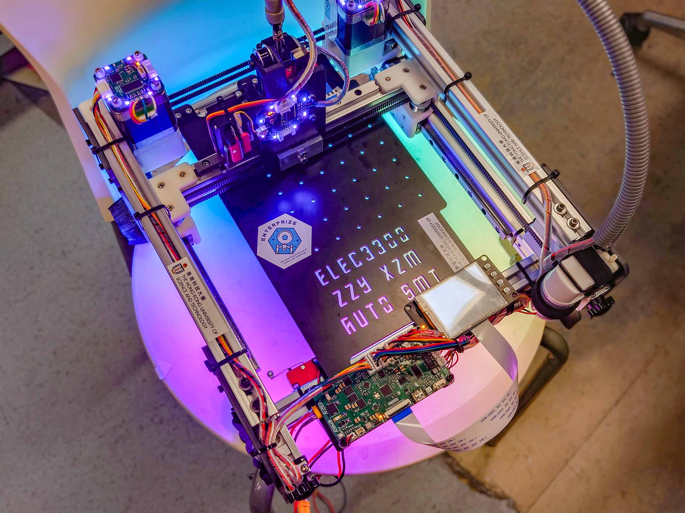
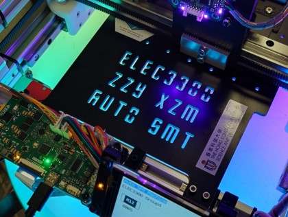
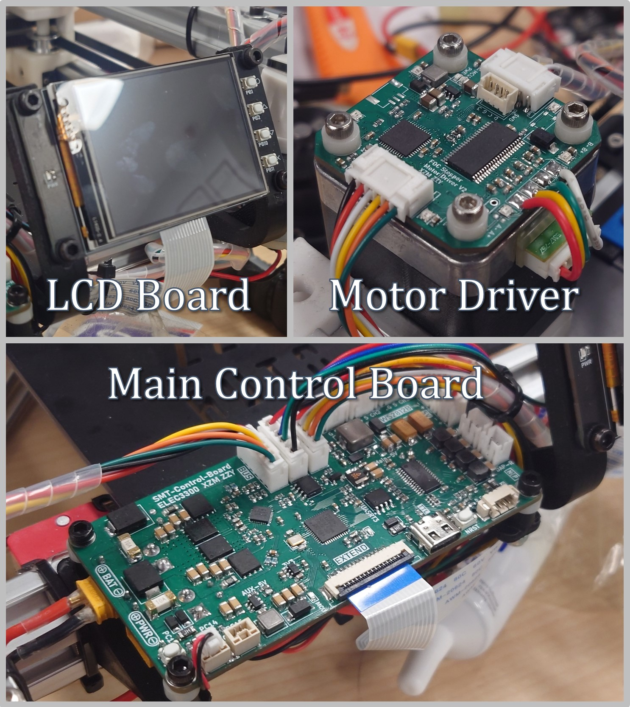
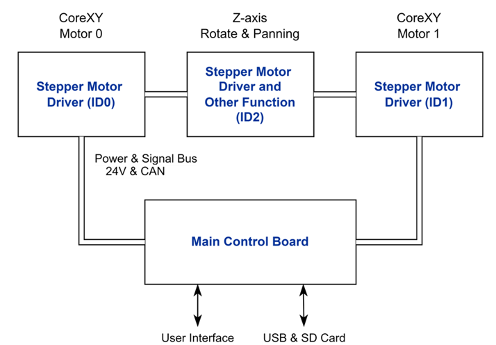
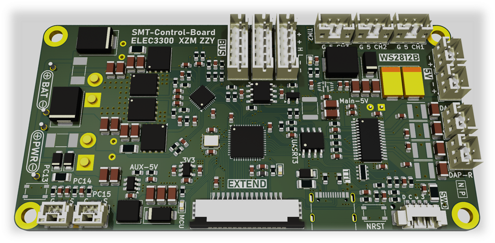
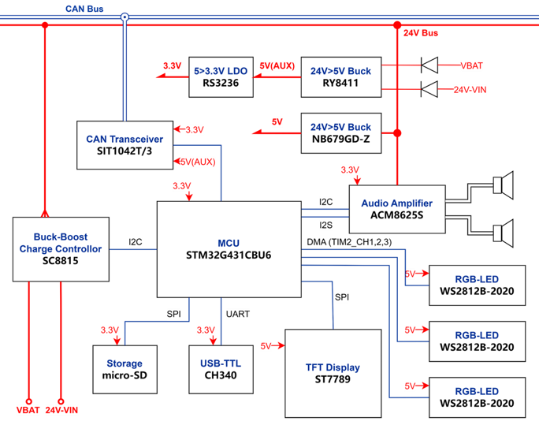
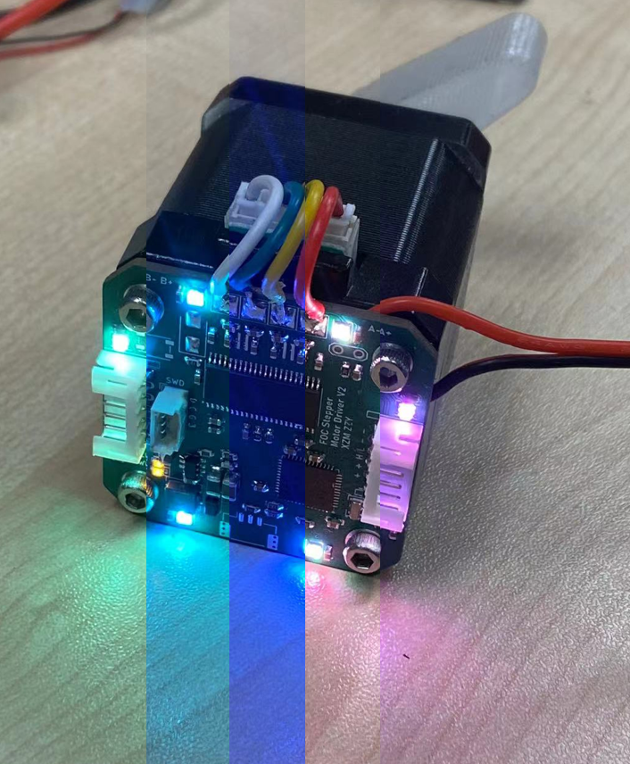
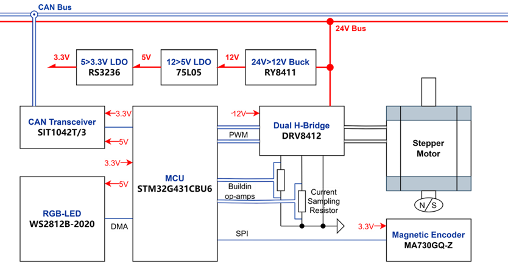

# :fire: Awesome :fire: SMT 贴片机

[](http://choosealicense.com/licenses/mit/)

Contributors:
<p float="left">
  <a href="https://github.com/baoqi-zhong"></a>
  <a href="https://github.com/ZimingXian"></a>
</p>

**Awesome SMT Machine** 是港科一门嵌入式课程的课设, 实现了软件、硬件及机械的完全自研并完全开源. 本贴片机采用 CoreXY 架构实现四自由度贴装, 使用 FOC 闭环步进电机驱动实现高精度高响应位置闭环. 搭配 4.2 寸彩色触摸屏实时显示贴装进度与工作状态. 在 Python 上位机控制下实现坐标文件解析与全自动贴装.

<p float="left">
  
  
</p>


# 硬件 (Hardware)
<p float="left">
  
  
</p>

基于 Kicad 设计的 4 层 PCB 主板与步进电机控制板. 

文件说明：
```
./Hardware/
    Main-Control-Board          主控板
    Stepper-Motor-FOC-Driver    42 步进电机 FOC 驱动器
    LCD-Board                   TFT 显示屏板
    Dual-Head-Motor-Driver      双头贴片机的贴装头控制板
```

## 主控板 (Main Control Board)
<p float="left">
  
  
</p>

基于 STM32G431CBU6 MCU, SC8815 电池管理芯片, ACM8625S I2S 音频功放. 详情见 [主控板原理图](./Hardware/Main-Control-Board/Main-Control-Board-Schematic.pdf)

- **UART 接口**：与 Python 代码通信. 
- **6S 电池充电器**：支持快充, 宽电压输入. 
- **音频功放与扬声器**：很有趣, 不是吗..? :yum:
- **CAN 总线通信**：高可靠性与扩展性. 

## 步进电机 FOC 驱动器 (Stepper Motor FOC Driver)
<p float="left">
  
  
</p>

基于 STM32G431CBU6 MCU, DRV8412 栅极驱动器, MA732 磁编码器, WS2812 RGB 灯. 详情见 [步进电机 FOC 驱动原理图](./Hardware/Stepper-Motor-FOC-Driver/Stepper-Motor-FOC-Driver-Schematic.pdf)

- **自研 FOC 算法**：力矩、速度、角度三闭环控制. 实现无发热, 高效率, 超静音的闭环控制. 进行了完整的 DQ 轴控制解耦, 反电动势前馈, 齿槽效应补偿, 死区补偿等.
- **14位高速磁编码器**：搭配自动校准算法, 自适应陷波器实现低噪声高精度闭环.
- **CAN 总线通信**：实现高可靠性与扩展性双向通信

# 软件 (Software)
基于 STM32CubeMX + Makefile + gcc 开发嵌入式软件. FOC 闭环算法采用裸机中断驱动, 代码高度优化, 执行效率高. 主控板基于 FreeRTOS 架构进行通信, 贴装控制, 电池充放电管理, 音乐播放等任务调度.

文件说明：
```
./Software/
    ClosePnP                        基于 tkinter 的贴片机上位机控制软件
    Main-Control-Board-Software     主控板嵌入式源码
    Stepper-Motor-Driver-Software   步进电机 FOC 源码
    MusicConverter                  将 .WAV 文件转换为 .c 数组的 Python 脚本
    Dual-Head-Motor-Driver-Software 双头贴片机贴装头 PCB 的电机驱动代码
```

# 机械结构 (Mechanical)
单头版本（初版）使用 C4D 设计. 较新的双头版本使用 SolidWorks 设计.
单头版本文件在：`./Mechanical/CoreXY.c4d` 或 `./Mechanical/CoreXY.stl`