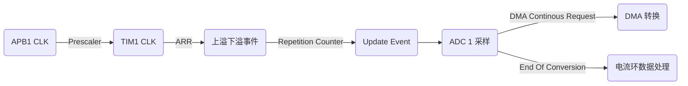

# Dual-Head-Motor-Driver

与电机 FOC 驱动一脉相承. 

## 板上资源
- 三个步进电机的三个全桥驱动
- 三个电机 A 相电流采样(AB 相不共用对地电阻), 以及内部 PGA 运放
- 电机驱动 nFAULT 状态输出
- 输入电压采样
- FDCAN
- GPIO 控制的阀

## TIM 和 ADC: 驱动波形产生与电流采样时机
我们有三个电机, 一共 12 个 timer channel 需要控制, 我们希望他们全部中心对齐. 全部采用中心对齐模式.
对应关系如下:
|相线|Timer & Channel|
|:--|:--|
|M1 A+|TIM3_CH1|
|M1 A-|TIM1_CH1|
|M1 B+|TIM1_CH2|
|M1 B-|TIM1_CH3|
|M2 A+|TIM2_CH1|
|M2 A-|TIM8_CH1N|
|M2 B+|TIM8_CH2N|
|M2 B-|TIM2_CH2|
|M3 A+|TIM4_CH1|
|M3 A-|TIM4_CH2|
|M3 B+|TIM4_CH4|
|M3 B-|TIM4_CH3|

时钟以 timer 1 为准, timer 1 触发 ADC 采样.

