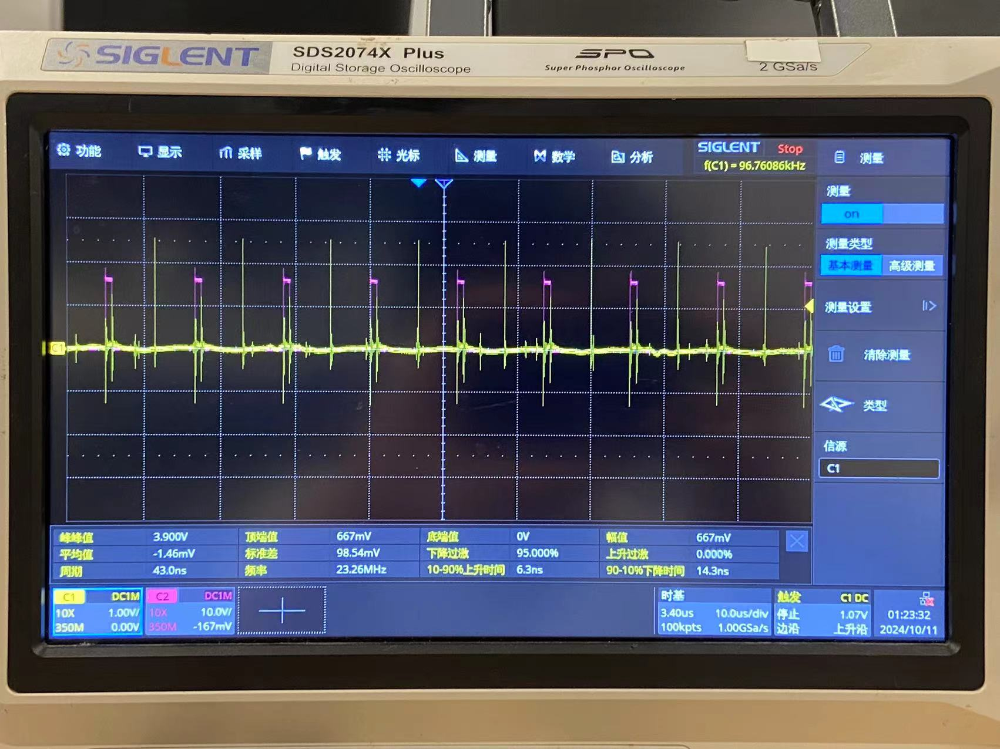
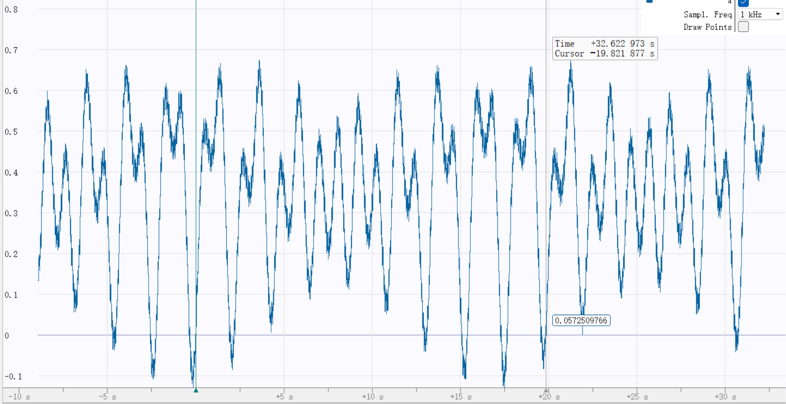
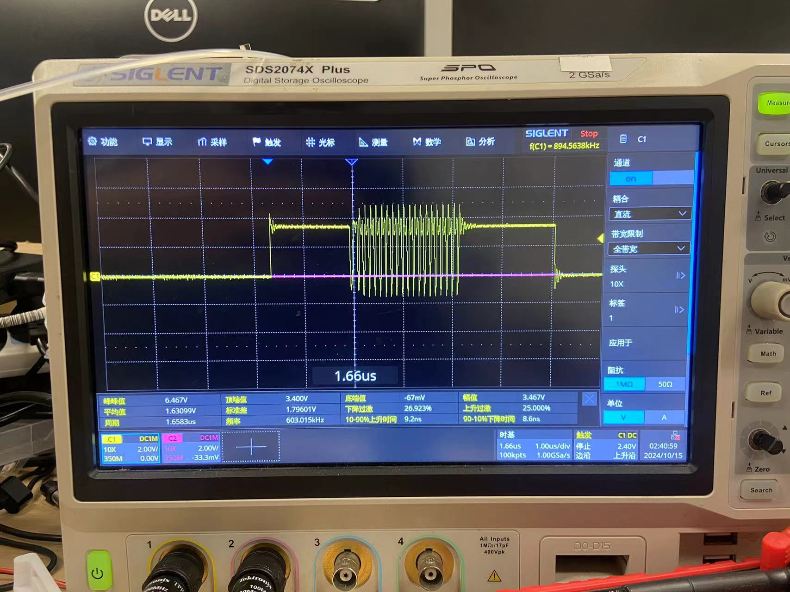

# RM2025-FOC-Algorithm
General FOC algorithm for BLDC and stepper motor

[TOC]

## 三相 BLDC 驱动波形
### SPWM
我们观察电机反电动势:

> 三个波形分别是三相端子相对三相交汇的中性点 N 点的电势

如果我们在三相端子处产生上图的波形, 则这种调制方式被称为 SPWM. (Sin PWM).

端子电压如下:
\[
\begin{cases}
    V_A = 12\sin(\omega t) + 12 \\
    V_B = 12\sin(\omega t + \frac{2\pi}{3}) + 12 \\
    V_C = 12\sin(\omega t + \frac{4\pi}{3}) + 12 \\
\end{cases}
\]


如果端子电压的范围是 $[0V, 24V]$, 则可计算三相交汇的中性点 $N$ 点的电压:
\[
V_{AN} + V_{BN} + V_{CN} = 0 \\
\therefore V_A + V_B + V_C -3 V_N = 0 \\
\therefore V_N = \frac{1}{3}((12\sin(\omega t) + 12) +  \\
(12\sin(\omega t + \frac{2\pi}{3}) + 12) +  \\
(12\sin(\omega t + \frac{4\pi}{3}) + 12)) = 12V
\]

所以中性点的电压恒为 $12V$, 所以电压的范围是 $[-12V, 12V]$
所以在任意时刻, 3 相电压的大小是:
\[
\begin{cases}
    V_A = 12\sin(\omega t) \\
    V_B = 12\sin(\omega t + \frac{2\pi}{3}) \\
    V_C = 12\sin(\omega t + \frac{4\pi}{3}) \\
\end{cases}
\]


3 相电压的矢量和大小是 $12V*2*\frac{\sqrt{3}}{2}\sin(\frac{2\pi}{3}) = 12V*\frac{3}{2} = 18V$


### SVPWM
> 参考资料: [SVPWM算法原理及详解](https://blog.csdn.net/qq_41610710/article/details/120512746)

我们规定 A 相朝右, B 左上, C 右下.

首先, 我们考虑我们能产生多少种基本矢量. 对于三相端子, 每一个都可以是 1 或者 0. 则一共有 8 种基本矢量, 包含两种全 1 全 0 的零矢量. 基本方向矢量互成 60 度角. 如下图:


每个基本方向矢量对应三个端子的电平如下:
|矢量|A端子|B端子|C端子|
|:--|:--|:--|:--|
|$U_4$|1|0|0|
|$U_6$|1|1|0|
|$U_2$|0|1|0|
|$U_3$|0|1|1|
|$U_1$|0|0|1|
|$U_5$|1|0|1|


下面我们分析电压矢量的大小. 
> 参考资料: [SVPWM之矢量幅值](https://jianwei.fun/?p=2037)

**基本方向矢量**: 以 $U_4$ 为例, 输出 $U_A = 24V$, $U_B = 0V$, $U_C = 0V$, 此时三个相线圈构成分压电路: $A$ 相电压为 $24V * \frac{2}{3} = 16V$; $B, C$ 相电压为 $24V * \frac{1}{3} = 8V$. 所以对于 $U_4$ 等效相电压的矢量大小是 $16 + 2*8*\frac{1}{2}=24V$. 所以对于 6 个基本方向的矢量, 最大电压边界为 $24V$.
**任意方向矢量**: 由于最大导通时间是固定的, 所以任意角度的最大幅值电压矢量的边界是基本方向矢量的 Liner Combination, 也就是图中的 **六边形**.
**不过调制任意方向矢量**: 但是我们希望最大电压的大小是均匀的, 所以我们取六边形的内接圆. 所以 3 相电压的矢量和大小是 $24 * \frac{\sqrt{3}}{2} = 12\sqrt{3} V$

我们对比发现, SVPWM 能产生的相电压的矢量和的大小是 SPWM 的 $\frac{2}{\sqrt{3}} = 1.15$ 倍, 电压利用率高了 $15\%$


**SVPWM 波形生成**
我们的目标是写一个函数能输出特定方向特定大小的电压矢量. (其实我们更加希望得到的是, 给定 $Uq, Ud, angle$ 输出三相 PWM 的占空比)
我们使用 uint16_t 定点数表示角度. 我们首先判断目标角度所在的扇区, 然后生成对应波形.

我们首先进行反 Park 变换, 把 $U_q, U_d$ 转换为 $U_{alpha}, U_{beta}$. 然后进行反 Clark 变换, 得到相邻基本矢量的作用时长. 最后根据扇区设计 7 段式 PWM 构造占空比.
在进行 反 Park 变换 的时候, 我们需要保证 $U_{alpha}^2 + U_{beta}^2 <= 1$ 我们可以对 $U_q, U_d$ 进行缩放, 也可以对 $U_{alpha}, U_{beta}$ 进行缩放. 在这里, 我们选择对 $U_{alpha}, U_{beta}$ 进行缩放.
很显然, 如果 $U_{alpha}^2 + U_{beta}^2 > 1$ 那么缩放的比例 ratio 为 $\frac{1}{\sqrt{U_{alpha}^2 + U_{beta}^2}}$. 我们可以用个快速平方根倒数算法玩一下.


**扇区判断**
> 参考资料: [SVPWM扇区判断](https://jianwei.fun/?p=2113)

根据目标坐标在划分平面的 6 条直线上下方进行判断.
\[
\begin{cases}
    l_1: y=0 \\
    l_2: y=\sqrt{3}x \\
    l_3: y=-\sqrt{3}x
\end{cases}
\]

**计算相邻基本矢量的作用时长**
> 参考资料: [SVPWM相邻矢量作用时长计算](https://jianwei.fun/?p=2140)

需要注意的是, 我们不希望在 $U_{alpha} = 1, U_{beta} = 0$ 的时候算出 $X = 1, Y = 0$, 而是希望算出 $X = \frac{\sqrt{3}}{2}, Y = 0$ 因为即使我们有能力产生大小为 1 的电压矢量, 我们需要保证全程都在六边形里面, 所以根据上文我们选择六边形的内接圆, 所以我们整体乘上 $\frac{\sqrt{3}}{2}$

1. **第一象限**
\[
\frac{2}{\sqrt{3}}
\begin{bmatrix}
    1 & \frac{1}{2} \\
    0 & \frac{\sqrt{3}}{2} \\
\end{bmatrix}
\begin{bmatrix}
    X \\
    Y \\
\end{bmatrix} =
\begin{bmatrix}
    U_{alpha} \\
    U_{beta} \\
\end{bmatrix}
\]
计算逆矩阵
\[
\frac{\sqrt{3}}{2}
\begin{bmatrix}
    1 & -\frac{1}{\sqrt{3}} \\
    0 & \frac{2}{\sqrt{3}} \\
\end{bmatrix}
\begin{bmatrix}
    U_{alpha} \\
    U_{beta} \\
\end{bmatrix} =
\begin{bmatrix}
    X \\
    Y \\
\end{bmatrix}
\]

2. **第二象限**
\[
\frac{2}{\sqrt{3}}
\begin{bmatrix}
    \frac{1}{2} & -\frac{1}{2}\\
    \frac{\sqrt{3}}{2} & \frac{\sqrt{3}}{2} \\
\end{bmatrix}
\begin{bmatrix}
    X \\
    Y \\
\end{bmatrix} =
\begin{bmatrix}
    U_{alpha} \\
    U_{beta} \\
\end{bmatrix}
\]
计算逆矩阵
\[
\frac{\sqrt{3}}{2}
\begin{bmatrix}
    1 & \frac{1}{\sqrt{3}} \\
    -1 & \frac{1}{\sqrt{3}} \\
\end{bmatrix}
\begin{bmatrix}
    U_{alpha} \\
    U_{beta} \\
\end{bmatrix} =
\begin{bmatrix}
    X \\
    Y \\
\end{bmatrix}
\]

3. **第三象限**
\[
\frac{2}{\sqrt{3}}
\begin{bmatrix}
    -\frac{1}{2} & -1 \\
    \frac{\sqrt{3}}{2} & 0 \\
\end{bmatrix}
\begin{bmatrix}
    X \\
    Y \\
\end{bmatrix} =
\begin{bmatrix}
    U_{alpha} \\
    U_{beta} \\
\end{bmatrix}
\]
计算逆矩阵
\[
\frac{\sqrt{3}}{2}
\begin{bmatrix}
    0 & \frac{2}{\sqrt{3}} \\
    -1 & -\frac{1}{\sqrt{3}} \\
\end{bmatrix}
\begin{bmatrix}
    U_{alpha} \\
    U_{beta} \\
\end{bmatrix} =
\begin{bmatrix}
    X \\
    Y \\
\end{bmatrix}
\]


4. **第四象限**
\[
\frac{2}{\sqrt{3}}
\begin{bmatrix}
    -1 & -\frac{1}{2}\\
    0 & -\frac{\sqrt{3}}{2} \\
\end{bmatrix}
\begin{bmatrix}
    X \\
    Y \\
\end{bmatrix} =
\begin{bmatrix}
    U_{alpha} \\
    U_{beta} \\
\end{bmatrix}
\]
计算逆矩阵
\[
\frac{\sqrt{3}}{2}
\begin{bmatrix}
    -1 & \frac{1}{\sqrt{3}} \\
    0 & -\frac{2}{\sqrt{3}} \\
\end{bmatrix}
\begin{bmatrix}
    U_{alpha} \\
    U_{beta} \\
\end{bmatrix} =
\begin{bmatrix}
    X \\
    Y \\
\end{bmatrix}
\]

5. **第五象限**
\[
\frac{2}{\sqrt{3}}
\begin{bmatrix}
    -\frac{1}{2} & \frac{1}{2}\\
    -\frac{\sqrt{3}}{2} & -\frac{\sqrt{3}}{2} \\
\end{bmatrix}
\begin{bmatrix}
    X \\
    Y \\
\end{bmatrix} =
\begin{bmatrix}
    U_{alpha} \\
    U_{beta} \\
\end{bmatrix}
\]
计算逆矩阵
\[
\frac{\sqrt{3}}{2}
\begin{bmatrix}
    -1 & -\frac{1}{\sqrt{3}} \\
    1 & -\frac{1}{\sqrt{3}} \\
\end{bmatrix}
\begin{bmatrix}
    U_{alpha} \\
    U_{beta} \\
\end{bmatrix} =
\begin{bmatrix}
    X \\
    Y \\
\end{bmatrix}
\]

6. **第六象限**
\[
\frac{2}{\sqrt{3}}
\begin{bmatrix}
    \frac{1}{2} & 1 \\
    -\frac{\sqrt{3}}{2} & 0 \\
\end{bmatrix}
\begin{bmatrix}
    X \\
    Y \\
\end{bmatrix} =
\begin{bmatrix}
    U_{alpha} \\
    U_{beta} \\
\end{bmatrix}
\]
计算逆矩阵
\[
\frac{\sqrt{3}}{2}
\begin{bmatrix}
    0 & -\frac{2}{\sqrt{3}} \\
    1 & \frac{1}{\sqrt{3}} \\
\end{bmatrix}
\begin{bmatrix}
    U_{alpha} \\
    U_{beta} \\
\end{bmatrix} =
\begin{bmatrix}
    X \\
    Y \\
\end{bmatrix}
\]

---

计算出每个象限的 X Y 分量之后, 我们产生 **7 段式 PWM**. **7 段式 PWM** 的思想是每次只切换一个 MOS 管的开关状态, 以中心对称的形式产生 PWM 波形, 这样可以尽可能地减少谐波, 保留基波能量.
每一个象限都会用到 $U_0, U_7$ 两个零矢量来补足时间.

需要注意的是, 产生 SVPWM 的顺序总是从 $U_0$ 开始 $U_7$ 结束, 且两个基本矢量要按从小到大排序.


1. **第一象限**
$U_4, U_6, U_0, U_7$

```wavedrom
{"signal": [
    {"name": "A 端子", "wave": "01.....0"},
    {"name": "B 端子", "wave": "0.1...0."},
    {"name": "C 端子", "wave": "0..1.0.."},
    {"name": "电压矢量", "wave": "23422432", "data": ["U0", "U4", "U6", "U7", "U7", "U6", "U4", "U0"] }
]}
```
$T_X = U_4; T_Y = U_6$

$\therefore T_C = \frac{1 - T_X - T_Y}{2}$
$T_B = T_C + T_Y$
$T_A = T_B + T_X$

\[
\therefore 
\begin{cases}
    T_A = \frac{1 + T_X + T_Y}{2} \\
    T_B = \frac{1 - T_X + T_Y}{2} \\
    T_C = \frac{1 - T_X - T_Y}{2} \\
\end{cases}
\]

2. **第二象限**
$U_2, U_6, U_0, U_7$

```wavedrom
{"signal": [
    {"name": "A 端子", "wave": "0.1...0."},
    {"name": "B 端子", "wave": "01.....0"},
    {"name": "C 端子", "wave": "0..1.0.."},
    {"name": "电压矢量", "wave": "23422432", "data": ["U0", "U2", "U6", "U7", "U7", "U6", "U2", "U0"] }
]}
```

$T_X = U_6; T_Y = U_2$

$\therefore T_C = \frac{1 - T_X - T_Y}{2}$
$T_A = T_C + T_X$
$T_B = T_A + T_Y$

\[
\therefore 
\begin{cases}
    T_A = \frac{1 + T_X - T_Y}{2} \\
    T_B = \frac{1 + T_X + T_Y}{2} \\
    T_C = \frac{1 - T_X - T_Y}{2} \\
\end{cases}
\]

3. **第三象限**
$U_2, U_3, U_0, U_7$

```wavedrom
{"signal": [
    {"name": "A 端子", "wave": "0..1.0.."},
    {"name": "B 端子", "wave": "01.....0"},
    {"name": "C 端子", "wave": "0.1...0."},
    {"name": "电压矢量", "wave": "23422432", "data": ["U0", "U2", "U3", "U7", "U7", "U3", "U2", "U0"] }
]}
```

$T_X = U_2; T_Y = U_3$

$\therefore T_A = \frac{1 - T_X - T_Y}{2}$
$T_C = T_A + T_Y$
$T_B = T_C + T_X$

\[
\therefore 
\begin{cases}
    T_A = \frac{1 - T_X - T_Y}{2} \\
    T_B = \frac{1 + T_X + T_Y}{2} \\
    T_C = \frac{1 - T_X + T_Y}{2} \\
\end{cases}
\]

4. **第四象限**
$U_1, U_3, U_0, U_7$

```wavedrom
{"signal": [
    {"name": "A 端子", "wave": "0..1.0.."},
    {"name": "B 端子", "wave": "0.1...0."},
    {"name": "C 端子", "wave": "01.....0"},
    {"name": "电压矢量", "wave": "23422432", "data": ["U0", "U1", "U3", "U7", "U7", "U3", "U1", "U0"] }
]}
```

$T_X = U_3; T_Y = U_1$

$\therefore T_A = \frac{1 - T_X - T_Y}{2}$
$T_B = T_A + T_X$
$T_C = T_B + T_Y$

\[
\therefore 
\begin{cases}
    T_A = \frac{1 - T_X - T_Y}{2} \\
    T_B = \frac{1 + T_X - T_Y}{2} \\
    T_C = \frac{1 + T_X + T_Y}{2} \\
\end{cases}
\]

5. **第五象限**
$U_1, U_5, U_0, U_7$

```wavedrom
{"signal": [
    {"name": "A 端子", "wave": "0.1...0."},
    {"name": "B 端子", "wave": "0..1.0.."},
    {"name": "C 端子", "wave": "01.....0"},
    {"name": "电压矢量", "wave": "23422432", "data": ["U0", "U1", "U5", "U7", "U7", "U5", "U1", "U0"] }
]}
```

$T_X = U_1; T_Y = U_5$

$\therefore T_B = \frac{1 - T_X - T_Y}{2}$
$T_A = T_B + T_Y$
$T_C = T_A + T_X$

\[
\therefore 
\begin{cases}
    T_A = \frac{1 - T_X + T_Y}{2} \\
    T_B = \frac{1 - T_X - T_Y}{2} \\
    T_C = \frac{1 + T_X + T_Y}{2} \\
\end{cases}
\]

6. **第六象限**
$U_4, U_5, U_0, U_7$

```wavedrom
{"signal": [
    {"name": "A 端子", "wave": "01.....0"},
    {"name": "B 端子", "wave": "0..1.0.."},
    {"name": "C 端子", "wave": "0.1...0."},
    {"name": "电压矢量", "wave": "23422432", "data": ["U0", "U4", "U5", "U7", "U7", "U5", "U4", "U0"] }
]}
```

$T_X = U_5; T_Y = U_4$

$\therefore T_B = \frac{1 - T_X - T_Y}{2}$
$T_C = T_B + T_X$
$T_A = T_C + T_Y$

\[
\therefore 
\begin{cases}
    T_A = \frac{1 + T_X + T_Y}{2} \\
    T_B = \frac{1 - T_X - T_Y}{2} \\
    T_C = \frac{1 + T_X - T_Y}{2} \\
\end{cases}
\]

至此, SVPWM 解算完毕.

需要注意的是, 代码里 outputUq 控制的是总相电压的矢量和大小, 而不是单独一相的电压大小

### 谐波注入
> 参考资料: [SPWM中三次谐波注入幅值的确定](https://blog.csdn.net/qq_50632468/article/details/116561097)

我们关心的是相电压, 是真正产生扭矩电流的电压. 如果我们给三相的端子电压同时加减一个共模电压, 相电压是不会改变的.
一种操作是, **三次谐波注入**. 意思是往三相同时加入频率为基波三倍的波形(三次谐波). 注入了三次谐波之后, 端子电压如下:
\[
\begin{cases}
    V_A = 12\sin(\omega t) + 12 + 12\cdot\frac{1}{6}\sin(3\omega t)\\
    V_B = 12\sin(\omega t + \frac{2\pi}{3}) + 12 + 12\cdot\frac{1}{6}\sin(3\omega t)\\
    V_C = 12\sin(\omega t + \frac{4\pi}{3}) + 12 + 12\cdot\frac{1}{6}\sin(3\omega t)\\
\end{cases}
\]

我们发现, 在注入三次谐波之后, 端子电压的 Peak-to-peak 电压减小了. 经计算, 端子电压的 Peak-to-peak 减小为 $24V * \frac{\sqrt{3}}{2} = 20.78456V$. 因此, 我们可以对调制电压进行缩放, 缩放为原来的 $\frac{2}{\sqrt{3}} = 1.15$ 倍. 
因为我们是对三个端子的电压同时加上了一个共模电压, 所以相电压也变为原来的 $1.15$ 倍.

我们可以计算三相交汇的中性点 $N$ 点的电压:

可以看到, 中性点 $N$ 点的电压正是我们注入进去的三次谐波.

---

**谐波注入与 SVPWM 区别**
我们可以画出 SVPWM 三相端子的电压曲线: \[TODO\]


## 两相步进电机 SVPWM ?
我们规定硬件连接:
htim1 CN1: A+
htim1 CN2: A-
htim1 CN3: B+
htim1 CN4: B-
规定以 A 为 alpha 轴, B 为 beta 轴.
在三相无刷电机控制中, 三个 PWM 通道实际上只有两个自由度, 因为需要满足电流和为 0. 所以, 我们需要进行 Clark 变换, 把三相电流矢量从 abc 坐标系降为到 Alpha Beta 坐标系方便控制.

但是我们注意到, 在两相步进电机中, 不存在两相电流的约束关系, 同时 A 相的开关对 B 相电流采样没有影响. 所以我们并不需要使用 SVPWM 对步进电机进行控制, 也不需要进行 Clark 变换, 因为步进电机的线圈轴直接就相当于 Alpha Beta 轴. 所以我们可以 **直接** 给两个通道的 CCR 寄存器赋值来控制电流.

我们直接通过修改寄存器控制两相四桥的通断情况来控制等效相电压. 对任意一相, 我们维持其中一个半桥**完全关闭**, 然后控制另一半桥的 High Low.
对于线序相反的步进电机, 只需要修改通道对应关系即可.

## TIM 和 ADC: 驱动波形产生与电流采样时机

**为什么需要用中心对齐 PWM**
因为采样电阻放在下管, 如下图:

只有在 A 侧下管打开的时候才能对相电流进行采样. 根据相电流方向不同, 分为两张情况:
- 电流从 A- 到 A+ 的时候 A+ 侧下管常开, 可以任意时间采样; 
- 电流从 A+ 到 A- 的时候 A+ 侧产生 PWM 波形, 需要在两个下管同时打开的时候采样, 也就是 PWM1 CN1 和 CN2 同时为 0 的时候触发采样. 

因此, 不管是哪个电流方向, 选择 PWM1 CN1 和 CN2 同时为 0 的时候触发采样能够满足要求. 此外, 我们希望 ADC 采样的间隔距离 PWM 动作点越远越好, 也就是 L->H 和 H->L 的中间最好. 因此, 我们使用 **中心对齐模式** 的 PWM, 然后使用 **Update Event** 触发 ADC 采样:

> 红色部分为 TIM1 其中一个 PWM 输出通道的波形, 黄色脉冲信号为 Update Event事件

在 CubeMX 里有个配置叫做 **Repetition Counter**, 它会在产生 (Repetition Counter + 1) 次上溢出之后才真正产生 Update Event 驱动 ADC. 因此, 我们把 Repetition Counter 配置为 1, 我们希望在上图 PWM 为 **LOW** 的最中点进行采样.

存在的一个问题是, 如果直接把 Repetition Counter 配置为 1, 采样会发生在偶数次 Event, 也就是 PWM 为 **HIGH** 的最中点处, 这不是我们希望的. 我们希望跳过第一个 Event, 然后在所有的奇数 Event 上采样.
实现这一点的方法在 Reference Manual RM0440.pdf 的 Figure 289. Update rate examples depending on mode and TIMx_RCR register settings 里, 即在 HAL_TIM_PWM_Start 之前手动 HAL_TIM_Base_Start 然后更新 Repetition Counter 寄存器为 1. 这样这个 1 值就会在下一次 Update Event.
具体代码是:
```c
// 这样做的目的是修改 TIM1 Update Event 的相位
HAL_TIM_Base_Start_IT(&htim1);
htim1.Instance->RCR = 1;

HAL_TIM_PWM_Start(&htim1, TIM_CHANNEL_1);
HAL_TIM_PWM_Start(&htim1, TIM_CHANNEL_2);
HAL_TIM_PWM_Start(&htim1, TIM_CHANNEL_3);
HAL_TIM_PWM_Start(&htim1, TIM_CHANNEL_4);
```

最终, 我们成功过滤出目标 Update Event 如下:

> 红色部分为 TIM1 其中一个 PWM 输出通道的波形, 黄色脉冲信号为 Update Event事件

---
接下来我们进行 **TIM 和 ADC 的 CubeMX 配置**.

1. 配置 TIM 模式为中央对齐模式
这样 TIM 的 counter 会先往上计数直到 ARR, 然后往下计数直到 0.
在计数到 ARR 之后, 会根据 **Repetition Counter** 产生 **Update Event**, 我们在 TIM 配置里把 Trigger Event Selection TRGO 选择为 Update Event 用来触发 ADC

2. 选择 PWM 模式
PWM 模式为 **PWM Mode 1**, 即正常极性. 配置为 High Polarity, 正常极性.

3. 选择 TIM 的 Output Event 为 Update Event, 如上文所述.

4. ADC 配置
在 ADC 里选择触发源为 **Timer 1 Trigger Out  Event**. 接受从 TIM 传来的

打开 DMA, 选择 **Circular Mode**, 同时打开 **DMA Continous Request**. 
**Circular Mode** 说的是如何处理 Buffer, 这里是把 Buffer 视为环形队列, 在软件单次触发或者 DMA Continous Request 触发, 把 buffer 填满了之后, 自动从头覆盖 buffer.
**DMA Continous Request** 是指在 ADC 单个通道转换完成之后自动触发 DMA 请求. 这样能保证多个通道之间的数据不会相互覆盖.

如果有多个通道, 我们打开 **Scan Mode**. Scan Mode 是在软件或者外部触发一次之后, 把所有通道都转换了. 必须配合 DMA + DMA Continous Request 使用, 否则后面的通道会把前面的覆盖掉.

**End Of Conversion** 作用是什么时候产生结束中断, 这里我们配成所有通道都转换完成才产生一次请求. 我们把电流环的程序放在 ADC 采样完成的回调函数里, 这样实现最高频率的电流环闭环.

所以整个调用链是这样的:


## 离散控制
突然想到一个很严重的问题, 就是 CCR = 1000 的话, 控制精度只有不到 10 bit, 相当于最小可控相电压是 24mV, 最小可控相电流是 100mA, 这是不可接受的.
所以结论是, timer 的 prescaler 是邪恶的, 让控制精度降低了, 正确操作应该是在 CCR 范围允许的情况下, 尽可能让 prescaler = 0.

电流环 & PWM 频率: $\frac{170MHz}{2*CCR} = \frac{170MHz}{2*4000} = 21.5KHz$
PWM 分辨率: 4000(12bits)
中心对齐模式的一个不好之处是脉冲宽度只能是偶数, 相当于精度降低了一倍.


## 电流采样与校准

使用 G4 内部运放构成同向放大器. 

**双向电流采集** 
由 2400 可知这是个非常经典的同向加法放大器. Opamp 输出电压被施加了 1.65V 偏置, 正反电流采样的范围一样.

**G4 内部运放**
这里选择 **Stand Alone** 模式, G4 内部的运放需要使用 **HAL_OPAMP_START** 来启用, 有点逆天, 老是忘记. 内部运放输出脚接出来, 可以同时使能 ADC 的引脚功能. 所以不属于 internally connect, 而是通过 pin 在外部实现连接.

**双 ADC 同步采样**
上面我们是使用两个 adc 分别进行采样, 使用两个 DMA 分别进行数据搬运. 存在一个可能是, 第一个 ADC 的 DMA 搬运完数据, 产生 Complete Callback 的时候第二个 ADC 的数据还没有被搬运完成. 这样就会一个相电流是新数据一个相电流是旧数据, 不利于电流闭环控制.

进一步的, 我们发现 G431 的 ADC1 和 ADC2 可以同步工作, 然后公用一个 DMA, 这样就不会引起到底是哪个 DMA Complete Callback 对数据进行处理的混乱.
我们把 TIM1 的模式改为 **Dual regualr simultaneous mode only**, 然后使能 **DMA Access Mode**. 还要把 ADC1 的 DMA 改成 Peripheral 和 Memory 双 Word. 因为在 dual 模式下, ADC1 作为主 ADC, ADC2 的转换结果会存到 ADC1 高 16 位上. 这样就能只用 **一个 DMA** 就能同步搬运两个通道的数据了.

具体代码如下:
```c
HAL_ADC_Start(&hadc2);
HAL_ADCEx_MultiModeStart_DMA(&hadc1, adcBuffer, 2);
```


## 磁编码器 MA732 使用, 校准 与 滤波
**驱动**
工作在 **16 bit SPI** 模式下, 之前用 8 bit SPI 配合软件 CS 是错误的用法. 

MA732 内部有个很小的 FLASH, 能够掉电存储校准数据. 在调试中遇到了 16bit 高低位顺序等勾八问题, 在使用错误的配置与其通信的时候可能不小心把数据写入到校准区域, 导致后续读出来的数据错误, 可能是 0xFFFF 或者是 0x0000. 根据 datasheet 里的默认寄存器内容重置 MA732 后问题解决.

在使用 SPI 与其通信的时候, 读取不能使用 HAL_SPI_Receive, 因为单纯的 Receive 的时候 MOSI 可能会有脏数据, 导致意外的命令写入. 正确办法是开一个空 buffer, 然后使用 **HAL_SPI_TransmitReceive** 与其通信.

因为 ADC 的转换需要时间, 所以考虑用 Update Event 的同时, 用 Update Event 中断触发 **HAL_SPI_TransmitReceive_IT**, 然后在 SPI 的 **transmit Complete Callback** 里解码. 

**校准与归零**
使用磁编码器内部的 Flash 可以在任意的角度归零. 但是为了方便, 我们首先将机械角度(的极对数倍)对齐到电角度, 然后再将此编码器角度设为零, 以此实现磁编码器校准. 我们调用 calibrateEncoder() 之后就会自动进行校准, 校准结果写在 calibrationResult 里面, 需要在 ozone 里 watch 然后手动 hardcode 到 ENCODER_BIAS 里面, 注意需要补足一个 dummy byte ENCODER_BIAS[256] = ENCODER_BIAS[0], 方便运算.

实际上存到 ENCODER_BIAS 里的值是偏移值 / 2, 这样设计的目的是把偏移压缩进一个 byte, 一共 256 Byte. 其余的点通过**定点数运算**的**线性插值**快速得到.

**磁编码器自动校准**

上图的第一个周期是正转时, 开环电角度与读取到的角度的差值, 第二个周期是反转的, 第三个周期是正反转差值的差值.
我们想要验证的是, 正反转的时候, 开环磁场角度领先机械角度的角度是固定的, 因此我们可以通过正反转求平均消除这个影响.
校准完毕得到 calibrationResult 之后, 在 ozone 里 watch calibrationResult, 然后导出到 python_code 文件夹, python 脚本自动生成校准数据 ENCODER_BIAS.

!!! 似乎仍然有 bug. 校准得到的偏移数据起始约为 3, 但是终止约为 11, 看起来像是正转的时候转过头了或者转快了(起始位置比终止位置 encoderError 小不少). 很逆天的解决办法是, 正转 -> 反转 -> 反转 -> 正转 的顺序来四次取平均.

四次旋转校准之后, openloop 时的结果:

可以看到, 在 openloop 情况下, 磁场角度稳定领先机械角度.
对比下图未校准情况, 有非常显著改进.


**内部滤波**
内部有个带通滤波器, 延迟有点大, 我们将滤波器截止频率跳到 730 Hz, 降低其延迟. 这一点在多极对数的电机上很关键.
以下是不同内部滤波的统计数据:
|Cutoff Freq|标准差|
|:--|:--|
|3000Hz|7.4|
|1500Hz|6.5|
|730Hz|4.2|

**外部滤波**
因为磁编码器读取出来到参与电流环运算有时间间隔, 这里使用一个简单的 **卡尔曼滤波器** 对运算时刻的角度进行估计.
Update Event 以最高速度试图调用磁编码器, 在每次成功调用 HAL_SPI_TransmitReceive_IT 之后立即将时间戳清零(也可以为负数, 用于细微调节时间). 在之后的每一次失败调用里都将时间戳 += 1. 
同时, 我们要求 MA732 驱动维护一个近期瞬时速度(可用一阶低通滤波实现), 在电流环运算的时候, 通过 MA732 的时间戳与瞬时速度可以计算出运算瞬时的电角度.
可以同时建立无感观测器, 但是没有必要.

---

**卡尔曼滤波器**
我们需要观测电机的角位置和角速度, 我们能观测到的值是当前的角位置, 我们也从上一个 encoder 和当前 encoder 算出一个速度.
所以:

我们输入的矩阵是:
$
y_{k} = 
\begin{bmatrix}
\theta_{角度_k} \\
\omega_{角速度_k}
\end{bmatrix}
$

我们观测得出的矩阵是:
$
x_{k} = 
\begin{bmatrix}
\theta_{角度_k} \\
\omega_{角速度_k}
\end{bmatrix}
$

我们有已知的控制输入 $I_q$
可以算出扭矩
$\tau = I_q * K_q$
其中, $K_q$ 为扭矩常数.

进一步算出角加速度 $\alpha$
$\alpha = \frac{\tau}{J} = \frac{K_q}{J} * I_q$

---

我们假设运动的过程是匀加速运动, 我们写出运动学方程:
$\theta_{角度_k} = \theta_{角度_{k-1}} + \omega_{角速度_{k-1}} * dt + \frac{1}{2}\alpha_{角加速度_{k-1}}dt^2$
$\omega_{角速度_k} = \omega_{角速度_{k-1}} + \alpha_{角加速度_{k-1}}*dt$


写成卡尔曼状态转移矩阵就是:
$
\begin{bmatrix}
\theta_{角度_k} \\
\omega_{角速度_k}
\end{bmatrix} = 
\begin{bmatrix}
1 & dt\\
0 & 1
\end{bmatrix}
\begin{bmatrix}
\theta_{角度_{k-1}} \\
\omega_{角速度_{k-1}}
\end{bmatrix} +
\begin{bmatrix}
\frac{1}{2}dt^2 \\
dt
\end{bmatrix} * \alpha_{角加速度_{k-1}}
$
对应:
$\hat{x}_{k} = F \cdot x_{k-1} + B \cdot u_{k} + w_{k}$
所以
$F = 
\begin{bmatrix}
1 & dt\\
0 & 1
\end{bmatrix}$

$B = 
\begin{bmatrix}
\frac{1}{2}dt^2 \\
dt
\end{bmatrix}$

$u_{k} = \alpha_{角加速度_{k-1}}$

同时, 协方差的估计如下:
$P_{k} = F \cdot P_{k-1} \cdot F^T + Q$

$P_{k}$: 状态协方差矩阵的先验估计
$Q$: 过程噪声 $w_{k}$ 的协方差矩阵


**状态校正**
在这种特殊情况下, 我们的观测值能被传感器读取到, 所以 $H = I$.

$x_{k} = \hat{x}_{k} + K_{k} \cdot (y_{k} - H \cdot \hat{x}_{k})$
$P_{k} = (I - K_{k} \cdot H) \cdot P_{k}$

其中, 
${x}_{k}$: 当前时刻状态估计的后验值 (滤波器最终输出)
$\hat{x}_{k}$: 当前时刻状态估计的先验值 (从状态预测阶段获得)
$y_{k}$: 传感器观测出来的值
$H$: 观测矩阵 把真实状态空间映射成观测空间
$I$: 单位矩阵

**计算卡尔曼增益**
$K_{k} = P_{k} \cdot H^T \cdot (H \cdot P_{k} \cdot H^T + R)^{-1}$

可以看到, 对于角速度的预测, 卡尔曼滤波器的工作得非常好. 看不出任何延迟.

去他妈的 操. 和一阶低通滤波器没有任何区别.  不玩了 一阶低通滤波牛逼.


## 磁编码器误差校准记录
对于缓慢的 SVPWM 固定速度开环强拖, 记录 SVPWM 输入角度与磁编码器读出角度的差值: 




进行单 electricAngle 采样并校正之后:


这个波形一共由以下几个周期的波形组合而成:
1. (最高频) 周期等于 SVPWM 输入角度的周期, 即 electric angle 的周期. 在图上似乎是噪声, 但不是. 是由 **齿槽转矩 cogging torque** 产生的 称为 **齿槽效应 Cogging**. 齿槽转矩 是转子磁铁与定子线圈上的铁芯相互吸引导致的扭矩. 在没有电流的时候转转子的段落感的来源. 在转子旋转的时候会产生周期性的扭矩, 对抗驱动电流的扭矩. 相位与驱动角相位相同.
2. 一个猫猫波形: 周期等于电机转子转动周期. 由磁编码器与磁铁不同心安装, 不平行安装导致的. 相位提前或落后驱动角相位, 导致产生变形的正选波. 理论上来说每一周期的猫猫波形应该相似, 但是有其他原因导致问题.

3. 最大时间尺度的波形: 由减速箱导致的磁场. 周期是转子频率的 8 倍 (减速比)
在输出轴转动到同一位置的时候, 最大尺度的误差波形总是出现重复. 可以很肯定地说此误差与减速箱有关. 怀疑是减速箱磁化.
误差 peak-to-peak 值约为 300, 相当于 1.65° 轴角度和 23° 电角度. 此误差不可忽略.

> 波形分解解读参见:
> https://build-its-inprogress.blogspot.com/2017/03/encoder-autocalibration-for-brushless.html
> https://community.simplefoc.com/t/simplefoc-sensor-eccentricity-calibration/2212

拓展:
对于齿槽效应有以下几种改善方法: 
1. 线圈定子改为斜槽. 但是会降低效率.
2. 一片片磁铁改为磁环, 但是磁场强度小, 扭矩小.
3. 软件抗齿槽

使用 scipy.optimize.curve_fit, scipy.fft.fft 对误差波形进行拟合.

在三个正弦叠加下可以拟合低频波, 六个正弦可以抵消齿槽效应.

## Park 变换与 FOC 闭环控制思路

我们使用 G4 的 Cordic 外设来计算三角函数, 同时乘上系数. 我们发现, 磁编码器的最高精度是 16 bit, 输出 PWM 精度约为 10 bit, 因此采用 15 bit 的 cordic 已经足够.
16 bit 模式的 cordic 可以在一个 32 bit 输入里面同时把两个输入参数打包进来.
具体使用方法参见:
> https://www.st.com/resource/en/reference_manual/rm0440-stm32g4-series-advanced-armbased-32bit-mcus-stmicroelectronics.pdf
> https://shequ.stmicroelectronics.cn/thread-635016-1-1.html

以下是 15bit 精度的示例代码:
```c
int32_t dualFloatToCordic15(float valueA, float valueB)
{
    int32_t CORDIC15;
    CORDIC15 = (int32_t)(valueB * 0x8000) << 16;
    CORDIC15 = CORDIC15 | (int32_t)(valueA * 0x8000);
    return CORDIC15;
}

void cordic15ToDualFloat(int32_t CORDIC15, float *valueA, float *valueB)
{
    // 处理高16位
    if (CORDIC15 & 0x80000000) // 为负数
    {
        *valueB = ((float)((CORDIC15 >> 16) & 0x7FFF) - 0x8000) / 0x8000;
    }
    else // 为正数
    {
        *valueB = (float)((CORDIC15 >> 16) & 0xFFFF) / 0x8000;
    }
    
    // 处理低16位
    if (CORDIC15&0x8000) // 为负数
    {
        *valueA = ((float)(CORDIC15 & 0x7FFF) - 0x8000) / 0x8000;
    }
    else // 为正数
    {
        *valueA = (float)(CORDIC15 & 0xFFFF) / 0x8000;
    }
}

static float cordicOutputSin1;
static float cordicOutputCos1;
static float cordicOutputSin2;
static float cordicOutputCos2;
hcordic.Instance->WDATA = dualFloatToCordic15(0.6667, 0.99999);
cordic15ToDualFloat((int32_t)(hcordic.Instance->RDATA), &cordicOutputSin1, &cordicOutputCos1);
hcordic.Instance->WDATA = dualFloatToCordic15(0.6667, 0.99999);
cordic15ToDualFloat((int32_t)(hcordic.Instance->RDATA), &cordicOutputSin2, &cordicOutputCos2);
```

> 可能可行的控制点: 在目标移动到距离目标位置小于一个 electricAngle 周期的之后, 增加给定固定位置的磁场.
> 目前输出的 Id Iq 在输出之前都会进行 Park 变换, 都会用到当前磁编码器的角度, 这可能会带来一些控制上的滞后性.
> 如果引入绝对位置的磁场, 可能可以增强响应.

---

targetIq 是内部的扭矩电流, 由速度位置 PID 算出来.
motorControlStatus.targetTourque 是最大扭矩. 在速度位置 PID 不工作的时候才用这个 motorControlStatus.targetTourque

### 坐标系变换的幅值转换
到底是选择等幅值变换还是等功率变换? 等幅值用的比较多. 这样采样得到的电流, 即相电流的幅值等于 Iq Id 的幅值. 然后在生成电压的时候直接生成相电压.
所以在传入 setPhaseVoltage 之前我们的限幅就不是 24 V 了, 而是根据上文限制到 $12\sqrt{3} V$


## 电流环 PI 控制器设计, 前馈与抗饱和

**前馈**
根据 https://blog.csdn.net/qq_39360369/article/details/121693910 的推导可知, dq 轴的状态方程中存在耦合项, 即 dq 电流会互相影响. 前馈的作用是是将 dq 轴解耦, 一方面是交叉解耦, 另一方面是抵消反电动势.
通过下面这个图设计前馈, 需要获取相电阻, 相电感, KV 值.


可以看到, 前馈直接加到 PI 控制器的输出结果上, 数学表达是:
```
//   Resistance  Inductance   Cross terms   Back-EMF   (see www.mathworks.com/help/physmod/sps/ref/pmsm.html)
vd = Rs*id   +   Ld*did/dt −  ωe*iq*Lq
vq = Rs*iq   +   Lq*diq/dt +  ωe*id*Ld     + ωe*ψm
```

我们转换变量名称, 也就是:
```c
backwardEMF = SPEED / KV;
Vq += Rs * Iq + SPEED * Ld * Id + backwardEMF;
Vd += Rs * Iq - SPEED * Lq * Iq;
```
> https://github.com/simplefoc/Arduino-FOC/issues/317

**弱磁控制**
取磁通量 $\lambda$. 我们知道, 线圈里的电流需要在每个周期内反向, 因此磁通量也反向. 当线圈里的最大磁通量越大, 在同等速度下, $\frac{d\lambda}{dt}$ 越大, 因此反电动势 bEMF 越大. 所以, 降低线圈里的磁通能够提高电流变化所需时间, 从而提高转速.
弱磁控制 weakened field control 的目的就是降低磁通, 以达到超过最大速度的速度.

弱磁控制的核心在于 \[TODO\]


## 速度环/位置环竞争 PID
速度环刷新频率为 4000Hz, 位置环刷新速率为 1000Hz.
不采用竞争方式. 竞争 PID 可以防止过冲位置. 
但是我们采用串级 PID. 这样在控制移动到目标位置的时候可以同时控制速度.


## 保护
**错误类型**
1. 三相电流和不为 0
2. 磁编码器断联
3. 相断联
4. 驱动器 FAULT
5. 驱动器 过温 Warning
6. 驱动器 过温 FAULT
7. 电机线圈过温
8. 过流
9. 欠压过压
10. 控制包非法

## 错误处理与状态机
用 ErrorHandler.c 实现的错误处理与自动恢复. 
motorErrorStatus.driverFault 和 FAULT 全局变量同步.
当 FAULT 被电机驱动触发, 而且电机是 enable 状态, 立即 disable 电机.
出现欠压, 过压, 过流, 过温会通过对应 Counter 延迟触发.

在非 FAULT 错误不在发生的时候, 会通过 Counter 自动恢复.

Optional: 当检测到电机被 disable, 而且所有错误都不再发生的时候, 可以自动 enable 电机.

## 通信
通信协议如下

所有数据都是 int16_t 类型.

主控板发送控制包:
CAN ID: 0x100 + ID = 0x101~0x108
```
        | 7 | 6 | 5 | 4 | 3 | 2 | 1 | 0 |
Byte 0: | 0 |      Control MASK         |
Byte 1: |          Control Data         |
Byte 2: |             Data              |
Byte 3: |             Data              |
Byte 4: |             Data              |
Byte 5: |             Data              |
Byte 6: |             Data              |
Byte 7: |             Data              |
```

1. 当 Byte 0 的 Bit 7 == 0
    * Byte 0:   Control MASK
        * Bit 7: 0
        * Bit 6: 位置设置 MASK                          0: 不修改, 1: 修改
        * Bit 5: 速度设置 MASK                          0: 不修改, 1: 修改
        * Bit 4: 扭矩设置 MASK                          0: 不修改, 1: 修改
        * Bit 3: 忽略错误 MASK                          0: 不修改, 1: 修改
        * Bit 2: 自动复位 MASK                          0: 不修改, 1: 修改
        * Bit 1: RGB 控制 MASK                          0: 不修改, 1: 修改
        * Bit 0: 使能输出 MASK                          0: 不修改, 1: 修改

    * Byte 1:   Control Data
        * Bit 7: 手动触发复位?                          0: 无效, 1: 复位    推荐: 0
        * Bit 6: 位置 Byte 是否有效(是否闭环位置)?      0: 无效, 1: 有效    推荐: 1
        * Bit 5: 速度 Byte 是否有效(是否闭环速度)?      0: 无效, 1: 有效    推荐: 1
        * Bit 4: 扭矩 Byte 使用电流闭环还是电压控制?    0: 电压, 1: 电流    推荐: 1
        * Bit 3: 强制忽略所有错误?                      0: 否,   1: 是      推荐: 0
        * Bit 2: 自动复位?                              0: 否,   1: 自动复位推荐: 0
        * Bit 1: 谁控制管理 RGB?                        0: 电机, 1: 主控板  推荐: 0
        * Bit 0: 是否使能输出?                          0: 禁用, 1: 启用    推荐: 1

    * Byte 2: 最大扭矩电流(加速度) 高 8 位
    * Byte 3: 最大扭矩电流(加速度) 低 8 位
    * Byte 4: 目标速度 高 8 位
    * Byte 5: 目标速度 低 8 位
    * Byte 6: 目标位置(增量) 高 8 位
    * Byte 7: 目标位置(增量) 低 8 位

2. 当 Byte 0 的 Bit 7 == 1
    * Byte 0:
        * Bit 7: 1
        * 其他位: 保留
    * 其他 Byte: 保留

    * Byte 5: LED 颜色 R
    * Byte 6: LED 颜色 G
    * Byte 7: LED 颜色 B


电机返回状态包:
CAN ID: 0x200 + ID = 0x201~0x208

Byte 0: 电机运行状态
    * Bit 7: 0
    * Bit 6: 位置闭环?                              0: 电压, 1: 电流
    * Bit 5: 速度闭环?                              0: 否,   1: 是
    * Bit 4: 电压/电流控制?                         0: 电压, 1: 电流
    * Bit 3: 强制忽略所有错误?                      0: 否,   1: 是
    * Bit 2: 是否会自动复位?                        0: 否,   1: 自动复位
    * Bit 1: RGB 谁控制?                            0: 电机, 1: 主控板
    * Bit 0: 电机是否使能                           0: Dis   1: Enable

Byte 1: 错误状态
    * Bit 7: 控制包解码错误?                        0: 无,   1: 有
    * Bit 6: 过温 Warning?                          0: 无,   1: 有
    * Bit 5: 过温错误?                              0: 无,   1: 过温
    * Bit 4: 过流错误?                              0: 无,   1: 过流
    * Bit 3: 欠压 过压错误 ?                        0: 正常, 1: 欠压或过压
    * Bit 2: 是否堵转?                              0: 无,   1: 有
    * Bit 1: 驱动器 FAULT?                          0: 无,   1: 有
    * Bit 0: 电机是否有 Error?                      0: 无,   1: 有

Byte 2: 实际转矩电流 高 8 位
Byte 3: 实际转矩电流 低 8 位
Byte 4: 编码器(输出轴单圈位置) 高 8 位
Byte 5: 编码器(输出轴单圈位置) 低 8 位
Byte 6: 到目标位置的执行进度(0~100%)


## BUG Record
测试发现, 给定固定 Ud!=0, Uq = 0 都能使其微弱转动, 且给定初始速度时, 仿佛有较大转动惯量, 很难启转停转. 可能是 timing 的问题(磁编码器采样时机/延迟)的问题.
示波器测量后发现, 在 enableFOCUpdate = 1 的时候, timer update event 的时机都发生变化, 具体是在正好最低点和最低点往右 1/4 个周期内浮动. 且变化速率很高. 在 enableFOCUpdate = 0 的时候,  timer update event 触发符合预期. 继续测量, 发现在 enableFOCOutput = 0, enableFOCUpdate = 1 的时候也正常. 推测是电流环里某些代码执行过慢导致的.
最终二分法定位到是如下代码段执行之后, update event, 电流环触发时机开始变得不稳定:
```
if(forceUd != -12345.0)
{
    outputUd = forceUd;
}
if(forceUq != -12345.0)
{
    outputUq = forceUq;
}

if(outputUq > 0.4)
{
    outputUq = 0.4;
}
else if(outputUq < -0.4)
{
    outputUq = -0.4;
}

if(outputUd > 0.4)
{
    outputUd = 0.4;
}
else if(outputUd < -0.4)
{
    outputUd = -0.4;
}
```

用 gpio 配合示波器进行分析, 发现是 MA732 与 SPI 读写过慢. 时序如下:
```
以下为实际时间:
0    us     Update Event
0.2  us     进入 MA732_Read()
1.5  us     离开 MA732_Read()
4.2  us     MA732 CS 下拉
5    us     MA732 CS 上拉
5.52 us     HAL_ADC_ConvCpltCallback 被调用, 正式进入电流环
16.9 us     HAL_SPI_TxRxCpltCallback 被调用, MA732 被读到.
```

可以看到 HAL_SPI_TxRxCpltCallback 非常晚才被调用, 甚至晚于电流环. 所以 HAL 库 SPI 纯勾八, 死慢.
我们换成 LL 库, 直接操作寄存器, 进行阻塞的 SPI 读写. 需要考虑在 timer update event callback 里阻塞是否有问题, 因为有可能是在 timer update event callback 执行完之后才触发 ADC 转换的.
我们懒得读实际代码, 我们直接做个实验:
在 TIM1_UP_TIM16_IRQHandler 里什么都不做, 和进行一大堆翻转 GPIO 的操作, 用来延时, 然后看进 adc Complete callback 的时间会不会变
进行垃圾操作之后, 5.7us 进 ADC Complete Callback
不进行垃圾操作, 3.36us 进 ADC Complete Callback
说明, ADC 是在 timer update event callback 之后触发的. 

---

但是, 我们注意到, 在 timer update event callback 里面有个 HAL_TIM_IRQHandler(&htim1); 我们刚刚是在它前面做垃圾操作的, 有没有可能 HAL_TIM_IRQHandler 就是用来触发 ADC 的?
我们尝试在 HAL_TIM_IRQHandler 之后做垃圾操作, 如果 adc 没有被延迟触发, 则我们的猜想正确.
在进入 TIM1_UP_TIM16_IRQHandler 之后的 1.7 us, 垃圾操作开始. 

而在 5.7us 之后, adc Complete callback 被成功触发! 和原来的时间完全一样! 我们的猜想正确!


以上结果说明, 在 STM32CubeMX 里配置的用 TIM1 Update Event 对 ADC 进行触发, 实际上不是硬件连接, 而是通过中断完成的. TIM1 Update Event 会调用  timer update event callback, 而在 callback 里的 HAL_TIM_IRQHandler 里面对 adc 完成了触发. 可惜的是, 我没能在 HAL_TIM_IRQHandler 代码里找到与触发 adc 相关的具体代码. 算了.

---

观察到, 在电机运动时, 给定一个反方向的瞬时力, 会导致电机反方向运动抖动. 在给定较大 Iq 时, 用手摁住电机能造成周期性的抖动.
尝试排除 Id 的影响, 将 Ud 强制设为 0. 观察波形得到, 抖动的过程分为两部分:]

在抖动第一个瞬间Uq 没有剧烈变化但是 Id 和 Iq 迅速改变极性.
观察 electricAngle 发现, 电机运动的方向瞬时改变


, Uq 没有剧烈变化但是 measueredId 和 measueredIq 发生了明显抖动:


这个现象似乎只在反方向突然加速的时候出现.
经过测试, 认为是丢步导致. 但是按理来说磁场方向应该时刻与磁铁垂直, 不应该出现丢步的情况, 除非刷新率不够.

上述现象在加入 EMF 的前馈以及 dq 解耦前馈之后得到了部分解决.
现在的现象变为, 在突然收到外部扭矩的时候会出现类似丢步的现象. 经过调整, 现象变为, 给定 Iq, 用刚体卡死电机, 此时稳态正常.
但是轻微地手动反向旋转, 电机输出扭矩会突然减小, 然后开始反向运转. 

**解决方案**
将磁编码器换为 MA732, 同时调高内部滤波器截止频率. 电流一下就闭了. 位置也一下闭了.

---

在开环转动的时候, 发现磁编码器位置有恒定变化的偏差. 在持续运行的时候偏差越来越大.
怀疑是浮点数误差导致的 浮点数的 significant 只有 20 bit, encoder 有 16 bit, 在转动 8 圈的时候就超过浮点数精度了. 所以改为 uint32_t.
全系列修改为定点数之后, 浮点数误差消除, 误差不再随着时间累加. 而是周期性变化.


---

在高速运转下, 会很偶尔出现卡顿, 观察发现是 electricAngluarVelocity 突然计算错误. 但是其他数据一切正常. 原因不知.


---

在 Uq=0.1, Ud=0 的情况下, 进行高速运动会疯掉. 具体表现见视频 1.mp4, 2.mp4
同时, 在 Uq = 0.

设为 Uq=0.0, Ud=0.2 有和上述一样的效果. **可能关键** 经过观察, 发现力突然减小的时刻发生在 measuredId 从 >0 变为 <0 的瞬间发生:

> 第一个峰谷 Id > 0, 此时没有失控, 第二个 Id < 0, 转矩突然减小, 电机失控.

同时观察到, 在失控起飞的过程中, measuredIq 和 measuredId 波形出现高频噪声. 且方向不断反向.

怀疑是磁编码器角度落后导致的 Iq Id 反 park 错误. 也有可能是测量到了电机反电动势造成的反向电流

将磁编码器换为 MA732, 同时调高内部滤波器截止频率之后, 丢步问题解决.